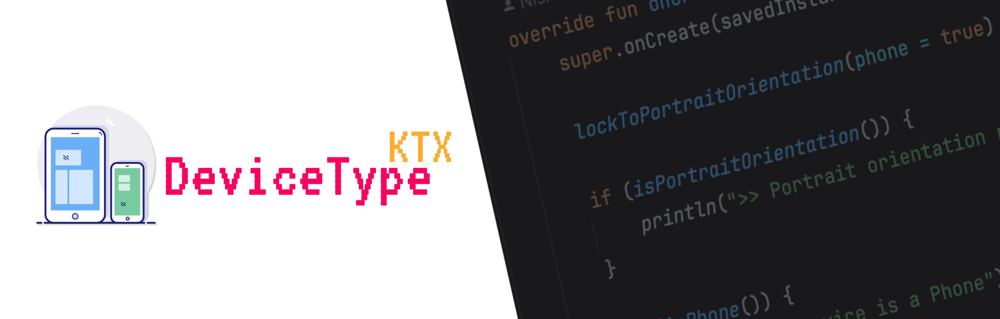

# Device Type KTX

Android library to provide Kotlin extensions for working with specific device types

## Use

[Checkout the usage docs](/usage-docs.md)

## Development

[Checkout the dev docs](/dev-docs.md)

## License

Copyright 2024 Nishant Srivastava

[Licensed under the Apache License, Version 2.0](/LICENSE).
